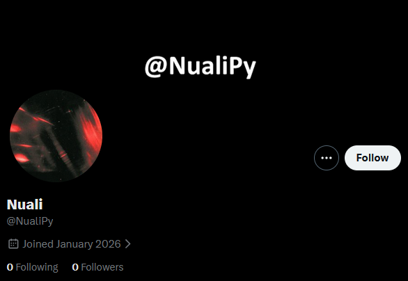

# Nuali

A Twitter/X bot that tweets a joke every 2 hours or so. Nuali allows performs basic actions such as liking, retweeting and replying to posts.

> Link to profile: https://x.com/NualiPy
> Inspiration: https://github.com/Lucas-Kohorst/Twitter-Bot  

 

## SDLC Phases

### Planning  

The purpose of this project is to develop a Twitter/X bot that performs actions such as posting tweets, retweeting, replying etc based on predefined rules.  

**Objectives:**  
- Automate basic interactions such as tweet posting, following etc.
- Learn and implement Twitter/X API usage.
- Apply SDLC concepts on a real project.  

**Scope Definition:**  
- **In Scope:**
    - Authenticating with Twitter/X API using the Tweepy library.
    - Performing desired actions automatically.
    - Reading and categorising tweets based on specific keywords or rules.
    - Handling API errors and rate limits.   

- **Out of Scope:**
    - Machine learning or sentiment analysis.
    - Managing multiple accounts.
    - Paid Twitter/X API features.  

**Feasibility:**  
- **Technical Feasiblity:**
    - Programming Language: Python
    - Library: Tweepy
    - Platform: Twitter/X API
    - Development Environment: Local Machine   

- **Economical Feasiblity:**
    - Development cost: None (open-source tools)
    - API usage: Non-Elevated API
    - Hardware: Existing personal computer   

- **Operational Feasiblity:**
    - Nuali runs automatically without user intervention.
    - Minimal maintenance required after deployment. 

**StakeHolders:**  
- Developers: @17sync, @Thor-Lowkey
- Supervisor: @ayyzenn
- End Users: Twitter/X users interacting with Nuali
- Platform Provider: Twitter/X  

**Timeline:**  
  

**Risk Analysis:**  
| Risk | Impact | Mitigation |
|------|--------|------------|
| API rate limits | Medium | Implement delays and error handling|
| Account Suspension | High | Follow Twitter/X automation rules |

 

### Requirements 

What the bot must do and it's constraints.

**Functional Requirements:**  
- Post tweets automatically at scheduled intervals.
- Favourite tweets containing specific keywords.
- Retweet tweets containing relevant keywords. 
- Reply to tweets containing specific keywords.
- Nuali's replys should be human-like and well thought out. 
- Nuali's behaviour must not cause any harm or spread toxicity.  

**Non-Functional Requirements:**  
- Nuali must run 24/7 with minimal downtime.
- Interval between tweets should be an hour.
- Nuali must be secure (API keys stored and not exposed)  

**Constraints:**  
- Uses the Twitter/X API.
- Subject to API limitations and policies.

 

### Design

This phase focuses on defining the system architecture, components, and workflows. The goal is to ensure the system is modular, secure, and compliant with Twitter/X API policies.

**System Architecture:**
Nuali follows a modular, script-based architecture where each core functionality is handled independently. This improves maintainability and scalability.

**Main Components:**
- Authentication Module
- Tweet Scheduler
- Keyword Scanner
- Interaction Handler
- Reply Generator
- Error & Rate Limit Handler
- Logging Module

**Component Design:**

- **Authentication Module:**
    - Uses Twitter/X API keys and tokens.
    - Credentials are stored securely using environment variables.
    - Authentication is handled via the Tweepy library.

- **Tweet Scheduler:**
    - Posts tweets at fixed intervals (1 hour).
    - Uses time-based scheduling (`time.sleep()` or scheduler libraries).
    - Prevents excessive posting to comply with API rules.

- **Keyword Scanner:**
    - Monitors tweets using predefined keywords.
    - Filters relevant tweets for retweeting, liking, or replying.
    - Ensures no duplicate interactions occur.

- **Interaction Handler:**
    - Performs actions such as:
        - Liking tweets
        - Retweeting tweets
        - Replying to tweets
    - Validates actions to avoid spam-like behavior.

- **Reply Generator:**
    - Generates human-like and respectful replies.
    - Replies are predefined or template-based.
    - Ensures responses are non-toxic and policy-compliant.

- **Error & Rate Limit Handler:**
    - Detects API rate limits and pauses execution accordingly.
    - Handles network failures and API errors gracefully.
    - Retries actions after cooldown periods.

- **Logging Module:**
    - Logs bot activities such as tweets posted and interactions made.
    - Helps with debugging and monitoring bot behavior.

**Data Flow:**
1. Authenticate with Twitter/X API.
2. Fetch tweets based on keywords.
3. Analyze tweet relevance.
4. Perform allowed interactions.
5. Log actions and errors.
6. Wait for the next execution cycle.

**Security Design:**
- API keys are never hardcoded.
- Environment variables or `.env` files are used.
- Sensitive data is excluded from version control.

**Design Constraints:**
- Must comply with Twitter/X automation rules.
- Limited by Non-Elevated API access.

 

### Development

This phase involves implementing the system based on the design specifications using Python and Tweepy.

**Development Environment:**
- Language: Python
- Library: Tweepy
- IDE: VS Code
- Platform: Local Machine
- Version Control: Git & GitHub

**Development Approach:**
The bot is developed incrementally, starting with authentication and followed by core functionalities.

**Implementation Steps:**

- **Step 1: API Authentication:**
    - Configure Twitter/X API credentials.
    - Verify successful authentication using Tweepy.
    - Store credentials securely using environment variables.

- **Step 2: Tweet Posting Module:**
    - Implement automated tweet posting.
    - Enforce a one-hour interval between tweets.
    - Add exception handling for API failures.

- **Step 3: Keyword-Based Tweet Fetching:**
    - Search tweets using specific keywords.
    - Filter tweets to avoid duplicate interactions.
    - Respect rate limits while fetching data.

- **Step 4: Interaction Features:**
    - Implement liking, retweeting, and replying functionality.
    - Ensure actions are triggered only when conditions are met.
    - Avoid excessive interactions to prevent account suspension.

- **Step 5: Reply Logic:**
    - Use predefined replies or templates.
    - Ensure replies are meaningful and human-like.
    - Avoid controversial or toxic language.

- **Step 6: Error Handling & Logging:**
    - Catch and handle API errors.
    - Implement delays for rate limits.
    - Log activities and errors for debugging.

**Version Control:**
- Code is maintained using Git.
- Commits are made after completing each feature.

**Development Constraints:**
- Limited API access.
- No machine learning or advanced NLP features.
- Must comply with Twitter/X policies.

 

### Testing

The testing phase ensures that Nuali operates correctly, reliably, and within defined constraints.

**Testing Objectives:**
- Verify correct functionality of all bot features.
- Ensure compliance with Twitter/X API policies.
- Detect and fix errors before deployment.

**Testing Types:**

- **Unit Testing:**
    - Test individual modules such as:
        - Authentication
        - Tweet posting
        - Keyword filtering
    - Verify expected outputs for each function.

- **Integration Testing:**
    - Test interaction between modules.
    - Ensure tweet fetching triggers correct interactions.
    - Validate reply generation and posting flow.

- **Functional Testing:**
    - Confirm all functional requirements are met:
        - Automated posting
        - Retweeting
        - Liking
        - Replying
    - Validate scheduling intervals.

- **Error Handling Testing:**
    - Simulate API rate limit errors.
    - Test network failures.
    - Verify recovery mechanisms and cooldown delays.

- **Security Testing:**
    - Ensure API keys are not exposed.
    - Confirm environment variables are properly loaded.
    - Check repository for accidental credential leaks.

- **Compliance Testing:**
    - Monitor bot behavior for spam-like activity.
    - Ensure replies are non-toxic and safe.
    - Verify adherence to Twitter/X automation rules.

**Test Environment:**
- Twitter/X test or limited real account.
- Local execution environment.
- Non-Elevated API access.

**Test Results:**
- Bugs are documented and fixed.
- Successful execution without crashes.
- Bot runs continuously with minimal downtime.

**Acceptance Criteria:**
- All core functionalities work as intended.
- No violations of Twitter/X policies.
- Bot operates stably for extended periods.
