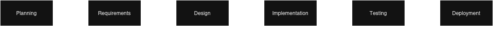

# Planning  

The purpose of this project is to develop a Twitter/X bot that performs actions such as posting tweets, retweeting, replying etc based on predefined rules.  

**Objectives:**  
- Automate basic interactions such as tweet posting, following etc.
- Learn and implement Twitter/X API usage.
- Apply SDLC concepts on a real project.  

**Scope Definition:**  
- **In Scope:**
    - Authenticating with Twitter/X API using the Tweepy library.
    - Performing desired actions automatically.
    - Reading and categorising tweets based on specific keywords or rules.
    - Handling API errors and rate limits.   

- **Out of Scope:**
    - Machine learning or sentiment analysis.
    - Managing multiple accounts.
    - Paid Twitter/X API features.  

**Feasibility:**  
- **Technical Feasiblity:**
    - Programming Language: Python
    - Library: Tweepy
    - Platform: Twitter/X API
    - Development Environment: Local Machine   

- **Economical Feasiblity:**
    - Development cost: None (open-source tools)
    - API usage: Non-Elevated API
    - Hardware: Existing personal computer   

- **Operational Feasiblity:**
    - Nuali runs automatically without user intervention.
    - Minimal maintenance required after deployment. 

**StakeHolders:**  
- Developers: @17sync, @Thor-Lowkey
- Supervisor: @ayyzenn
- End Users: Twitter/X users interacting with Nuali
- Platform Provider: Twitter/X  

**Timeline:**  
  

**Risk Analysis:**  
| Risk | Impact | Mitigation |
|------|--------|------------|
| API rate limits | Medium | Implement delays and error handling|
| Account Suspension | High | Follow Twitter/X automation rules |